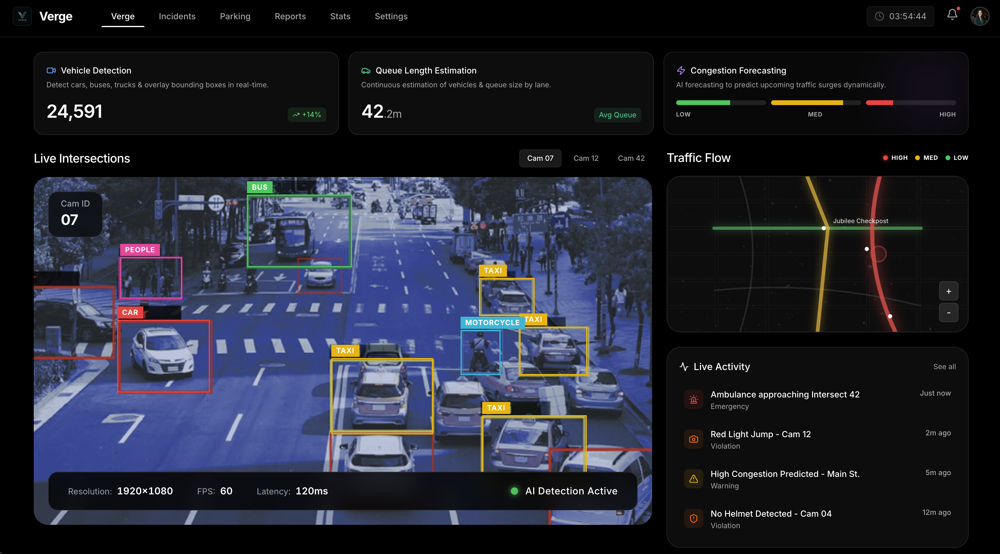

<div align="center">
  
  <h1>🚀 Verge: Smart Traffic Operations Platform</h1>
  <p><em>An open-source, AI-driven urban monitoring & analytics engine.</em></p>
  
  <p>
    
    
    
    
    
    
  </p>
</div>

---

## 🌟 Overview

**Verge** is a dual-component smart traffic monitoring ecosystem engineered to optimize city-scale traffic control.

We've brought together a **cinematic, high-fidelity React frontend** and a **hardcore YOLO-powered Python backend** to create a demo-ready, technically immense operation UI that actually processes video streams. 💥

- **Frontend**: A Next.js operator dashboard brimming with glassmorphism, Framer Motion animations, live KPI cards, and dynamic visual state.
- **Backend**: A FastAPI inference engine that ingests synchronous CCTV footage, runs object detection logic, evaluates congestion arrays, and prescribes traffic light timings in real time!

---

## 🔥 Quick Start

Ready to get your hands dirty? Here’s how you spin up the entire stack... locally! 🛠️

### 1️⃣ Frontend (The Interface)

Spin up the Next.js visual playground:

```bash
cd frontend
npm install
cp .env.example .env.local
npm run dev
```

> **Note:** The frontend beams down at `http://localhost:3000`.

### 2️⃣ Backend (The Brains)

Fire up the FastAPI inference server using `uv`:

```bash
cd backend
uv sync
uv run verge-traffic download-model
uv run verge-traffic serve --host 0.0.0.0 --port 8000
```

> **Note:** The backend hums along at `http://127.0.0.1:8000`.

---

## 🏗️ Technical Architecture

The codebase is split meticulously into presentation and execution layers.

### Repository Layout 📂

```text
verge/
├── README.md             <- You are here! 📍
├── screenshot.png        <- 📸 System sneak peek!
├── backend/
│   ├── app/traffic_monitor/
│   │   ├── api.py           # API endpoints
│   │   ├── cli.py           # Command Line tools
│   │   ├── config.py        # Settings & thresholds
│   │   ├── detector.py      # Core inference engine 🧠
│   │   ├── model_store.py   # AI Asset Mgmt
│   │   └── signal_optimizer.py # Smart algorithms
│   ├── tests/
│   ├── pyproject.toml
│   └── uv.lock
└── frontend/
    ├── app/                 # Next.js 16 app router
    ├── components/          # Reusable UI widgets
    ├── lib/                 # Shared data / Utils
    ├── public/              # Static assets
    ├── package.json
    └── next.config.ts
```

---

## 💻 The Frontend: A Cinematic Experience

Built with the bleeding edge: **Next.js 16**, **React 19**, **Tailwind CSS v4**, and **Framer Motion**. It's fast, gorgeous, and dynamic. ✨

### Core Routes:
- `/` - The **Marketing Landing Page**. Parallax scrolling, raw copy, auto-playing videos. It sells the vision.
- `/dashboard` - The **Command Center**. This is where the magic happens. Keybinds included (`0` to home, `1`-`6` for tabs).

### The Tabs:
1. **Verge (Traffic Operations):** The flagship view. Features a massive **Traffic Monitor**, violation alerts, flow mapping, and the crucial **Junction Upload Console** (which interacts directly with the Python API).
2. **Incidents:** A fully-featured data table of traffic violations powered by client-side local storage that updates upon real video analyses.
3. **Parking:** UI simulation mimicking live parking availability with a 48-cell randomized spot matrix.
4. **Reports:** Aesthetic presentation layer outlining PDF/real-time reporting capabilities.
5. **Stats:** Hardcoded analytical dashboard breaking down environmental and volume data using `recharts`.
6. **Settings:** A conceptual global systems configuration interface.

---

## ⚙️ The Backend: The Inference Engine

The backend isn’t just smoke and mirrors—it actually rips through MP4s to count cars, buses, bikes, and emergency vehicles. 🚑🚓

Powered by **Python 3.11+**, **Ultralytics YOLO**, **YOLOWorld**, and **OpenCV**.

### What It Calculates:
- **Per-view Object Metrics**: Absolute counts, peak congestion, estimated unique agents.
- **Weighted Load Scores**: Different vehicles incur varying weights against total intersection capacity.
- **Signal Recommendations**: Proportionally allocates `green light` pulses based on real-time loads.
- **Emergency Evasion**: Priority overrides for detected ambulances/fire trucks, halting offending cross-traffic dynamically.

### Output Generation:
The service spawns `traffic_summary.json` blobs and writes out fully annotated `.mp4` video pipelines with bounding boxes.

---

## 🔌 API Reference

### `POST /analyze`

The beating heart of the system. Throw your raw footage here.

**Headers:** `multipart/form-data`

**Parameters:**
- `videos` (File, 1-4 items): The angle footage.
- `cycle_time` (Int): Total cycle duration (default: `120s`).
- `min_green` / `max_green` (Int): Bounds for signal time allocation.

**Response Structure (Abbreviated):**
```json
{
  "run_id": "20260331-120000-ab12cd34",
  "cycle_time_seconds": 120,
  "summary_url": "http://127.0.0.1:8000/outputs/.../traffic_summary.json",
  "recommended_green_times_seconds": {
    "view_1": 42,
    "view_2": 15,
    "view_3": 63
  },
  "signal_sequence": ["view_3", "view_1", "view_2"]
}
```

---

## 🧪 Testing & Limitations

### Testing
Backend logic has test coverage focusing on the gnarly bits: signal allocation bounds, incident feed sorting, override priorities, and engine fallbacks. Run 'em:
```bash
cd backend
uv run pytest
```

### Known Limitations ⚠️
- The dashboard is a hybrid of **live, backend-supplied data** and **UI simulation states**.
- Parking, reports, and settings are currently aesthetically fleshed out but lack persistent logic backing.
- Analysis operations are deeply hardware-bound. Heavy video loads will drastically spike CPU/GPU times. Plan accordingly!
- CORS is restricted exclusively to local loops for dev right now.

---

<div align="center">
  <p>Built with 🩸, 💧, and ☕ for the cities of tomorrow.</p>
</div>
